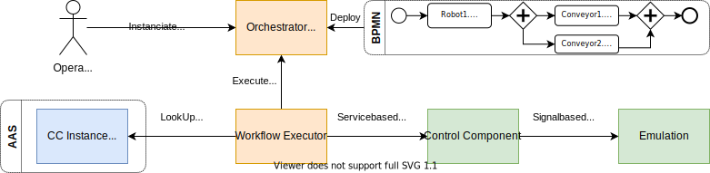
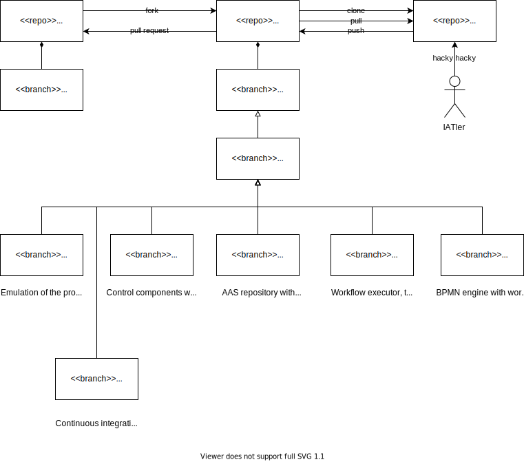

# ACPLT BaSys Demonstrator - Simple Orchestration

This repository holds the source code for a simplified version of the demonstrator used to evaluate BaSys concepts in the BaSys4.2 project.
It is provided by the [Chair of Information and Automation Systems for Process and Material Technology](https://www.plt.rwth-aachen.de/cms/~eety/plt/?lidx=1).
Its architecture is schematically shown in the following figure.

As depicted in the figure, the demonstrator contains:

* Emulation:
A simulated production process of plastic lids that are screwed to a plastic tin in [Unity 3D](https://unity.com), with a [shared memory (SHM)](https://docs.microsoft.com/en-us/windows/win32/memory/creating-named-shared-memory) as simplified field bus
* CC:
BaSys Control Components with an OPC UA server to control them, using the [C3](https://git.rwth-aachen.de/acplt/basys4.2/c3) and [CCProfilesUA](https://git.rwth-aachen.de/acplt/basys4.2/ccProfilesUA) C libraries developed in BaSys4.2
* AAS:
An Asset Administration Shell repository based on the [BaSyx Python SDK](https://github.com/eclipse-basyx/basyx-python-sdk) describing the control components endpoints via the control component instance submodel, which is currently standardized by the [IDTA](https://industrialdigitaltwin.org/en/content-hub/submodels)
* Executor:
A python workflow executor process, that executes service tasks from the BPMN processes using the AASes to find control components to control them via OPC UA
* BPMN:
The workflow engine [camunda](https://camunda.com) to instanciate [BPMN](https://www.omg.org/spec/BPMN/2.0/About-BPMN/) production processes

## Comparision to the BaSys4.2 Demonstrator

The BaSys4.2 project build a common demonstrator to evaluate new and advanced concepts of the project.
It was presented at the Hannover Messe 2021 online and in various research papers, e.g.:

* Julian Grothoff, Sten Grüner, Christian Barth, Alexander Kehl, Matthias Freund and Tobias Klausmann. "Asset Administration Shell as Integration Layer forthe Orchestration of Mixed Process and Manufacturing Plants", ETFA 2022, Stuttgart.

The orchestration architecture of the original BaSys4.2 demonstrator is shown in the following more comprehensive figure.
Parts that are provided in the simplified version here are denoted as black boxes.

In comparision to the simplified demonstrator in this repository there is no:

* AAS registry, to find and resolve AASes
* Capability checking and matching to find the production resources of the production process
* Simulation of parts of the plant and control components via FMUs for virtual commissioning
* Use of multiple AAS SDKs
* Use of multiple, multi vendor soft PLCs for the control components
* Integration of MTP modules
* Dashboard based on the AAS information

## Repository Structure

The structure of the branches of this repository, which mainly reflects the folder structure, is shown in the following figure.

