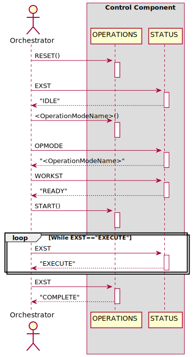

# Workflow Executor

This folder contains a python script to facilitate a workflow executor.
The executor:

* queries the workflow engine Camunda for open service tasks with a specific tag via the Camunda HTTP/REST API
* looks up the OPC UA endpoint of the control component which was requested by the service task in the AAS repository server via its HTTP/REST API
* connects to the OPC UA endpoint and executes the desired operation mode (skill), via a control component protocol.

The sequence for the control component excution is shown exemplarily in the following figure.

